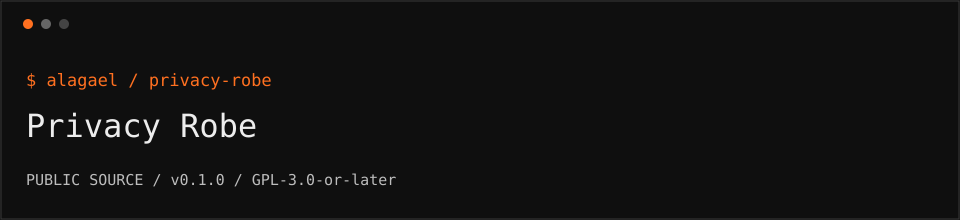

<p></p>

# Privacy Robe

Local BIP-39 seed splitting and recovery with threshold SLIP-39 shares. Public source and disposable examples; no hosted service.

```text
repository   github.com/alagael/privacy-robe
release      0.1.0 / public beta
audit        not independently audited
support      support@alagael.xyz
```

## What ships

An ESM library that splits an existing BIP-39 seed's entropy into threshold SLIP-39 shares and recovers the original BIP-39 words. It performs cryptographic work locally; this repository includes no hosted API or application backend.

```sh
git clone https://github.com/alagael/privacy-robe.git
cd privacy-robe
pnpm install --frozen-lockfile
pnpm run build
pnpm test
node examples/roundtrip.mjs
pnpm pack
```

Node.js 22+ and pnpm 10.17.1 are required. Build output is `dist/index.js` with TypeScript declarations. GitHub releases provide installable archives; the package name does not imply npm-registry publication.

## Disposable round trip

```js
import { splitSeed, recoverSeed } from "./dist/index.js";

// Public BIP-39 test vector. Never fund a wallet derived from it.
const fixture = "abandon abandon abandon abandon abandon abandon abandon abandon abandon abandon abandon about";
const shares = await splitSeed(fixture, 2, 3, "");
const recovered = await recoverSeed(shares.slice(0, 2), "");
if (recovered !== fixture) throw new Error("Round trip failed");
```

Keep shares apart and offline. Do not paste real seeds or shares into issue trackers, terminals with history recording, cloud notebooks, or sample code.

## API

| Function | Purpose |
| --- | --- |
| `checkBip39(words)` | Validate word count, English words, and checksum |
| `splitSeed(words, threshold, count, passphrase)` | Produce threshold shares |
| `recoverSeed(shares, passphrase)` | Recover original BIP-39 words |
| `parseShares(text)` | Parse supported text exports |
| `sampleSeed()` | Generate a disposable demonstration seed |
| `qrSvg(text)` | Render a QR SVG locally |

## Important compatibility warning

These shares represent the entropy of an existing BIP-39 seed. **Do not restore them directly as a native SLIP-39 wallet:** that may derive a different wallet. Recover the original BIP-39 words with this library first.

A wrong optional passphrase can produce a different valid result. Threshold sharing does not protect against a compromised device, malicious software, careless storage, or sufficient keepers colluding. JavaScript strings cannot be reliably wiped from memory. Recovery tools and instructions must remain available to your beneficiaries.

## Provenance

The name adapts the privacy theme of a physical garment in [Snowmoon, Chapter 1](https://vitalik.eth.limo/snowmoon/html/chapter-1.html). The novel does not specify this seed-sharing mechanism, and this project is not endorsed by its author.

Own source: GPL-3.0-or-later. Third-party source snapshots and modifications retain their notices in [THIRD_PARTY_NOTICES](THIRD_PARTY_NOTICES.md).

## Participate

[CONTRIBUTING](CONTRIBUTING.md) · [SECURITY](SECURITY.md) · [RELEASING](RELEASING.md)
